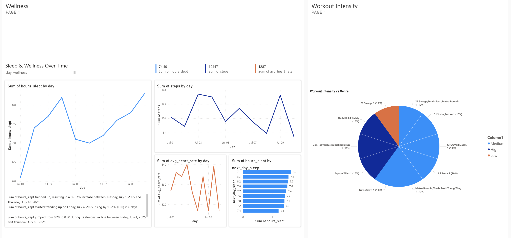
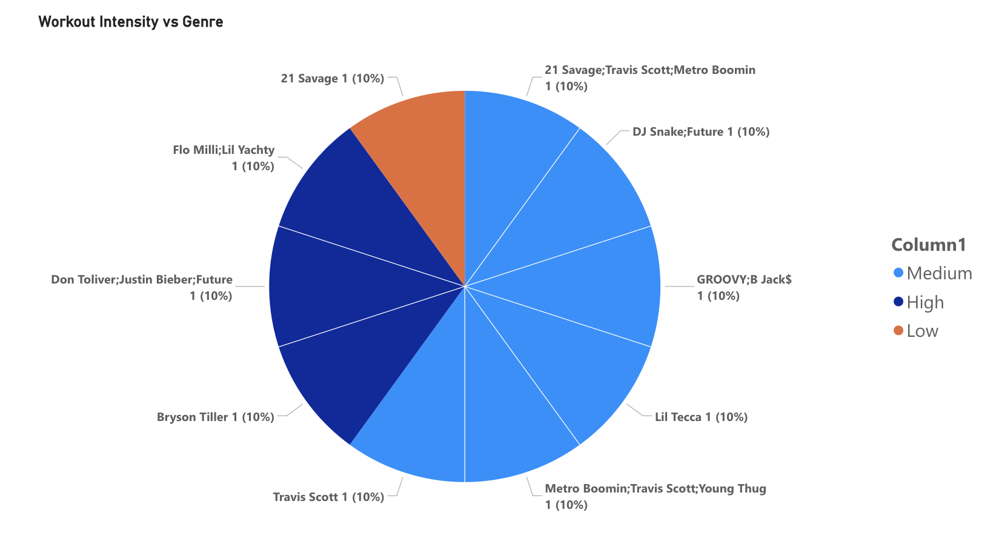
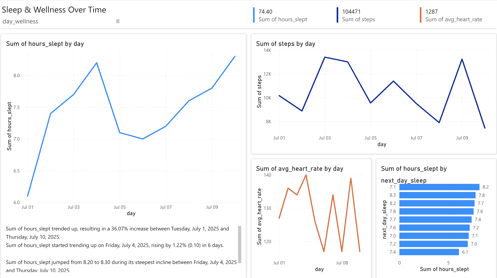

# Spotify + Fitness Dashboard — Personal Mood & Workout Analytics 

## What This Is
An end-to-end analytics project combining my **Apple Watch fitness data** and my **Spotify “Gym Rat” playlist** to explore how **music genres and moods affect workouts and wellness**.

- **Stack:** CSVs (Apple Watch + Spotify Exportify) → **MySQL** (joins, views, queries) → **Power BI** (interactive visuals)  
- **Goal:** Show how music choice (genre, tempo, mood) influences workout intensity, calories burned, steps, heart rate, and even sleep.

---
- **Findings:** https://docs.google.com/document/d/1BBJ8_Lwe6W5ATVKsXmvVObwoWZeBJTrCewgFzCa0tsc/edit?usp=sharing 

---

## Key Questions Answered
- How do **workout intensity levels** align with the **genres** I listen to most?  
- Which **moods** (upbeat, calm, intense) dominate my workouts, and how do they affect calories, steps, and HR?  
- Does listening to **upbeat vs. calm music** influence my **sleep and wellness** the same or next day?  

---

## Data Sources
- **Fitness Data (Apple Watch):**  
  - 50 days of personal data (`date, steps, calories_burned, workout_minutes, avg_heart_rate, hours_slept`)  

- **Music Data (Spotify Exportify + Audio Features):**  
  - Track Name, Album, Artist(s), Genre  
  - Danceability, Energy, Loudness, Mode, Liveness, Tempo  

- **SQL Modeling:**  
  - Created linking table `workout_music` to join fitness and playlist tracks  
  - Built views (`v_track_mood_buckets`, `v_workout_dominant_mood`, `v_day_wellness`)  

---

## SQL Highlights
- **Workout Intensity Buckets** (Low / Medium / High based on HR & minutes)  
- **Mood Buckets** from audio features (Upbeat, Calm, Intense, Neutral)  
- **Wellness Trends** with same-day and next-day sleep comparisons  

---

## Dashboard Views

### 1. Dashboard 

---

### 2. Workout Intensity by Music Genre 

---

### 3. Sleep & Wellness Over Time  

---

## Insights & Takeaways
- High-intensity workouts most often paired with **Hip-Hop and EDM**.  
- **Upbeat/high-energy tracks** correlated with more calories burned and steps.  
- **Calmer playlists** aligned with lower HR workouts and slightly better sleep recovery.  

---

## Why This Matters
My project isn’t just about SQL and Power BI but it’s about **turning personal data into meaningful insights**.  
It shows my ability to:  
- Ingest and model multi-source data (CSV, API-style exports)  
- Write analytical SQL (joins, views, aggregations)  
- Build interactive dashboards that **tell a story**  

---

## Tech Stack
- **Database:** MySQL  
- **Data Prep:** SQL (views, case statements, aggregations)  
- **Visualization:** Power BI  
- **Sources:** Apple Watch CSV, Spotify API 
---
